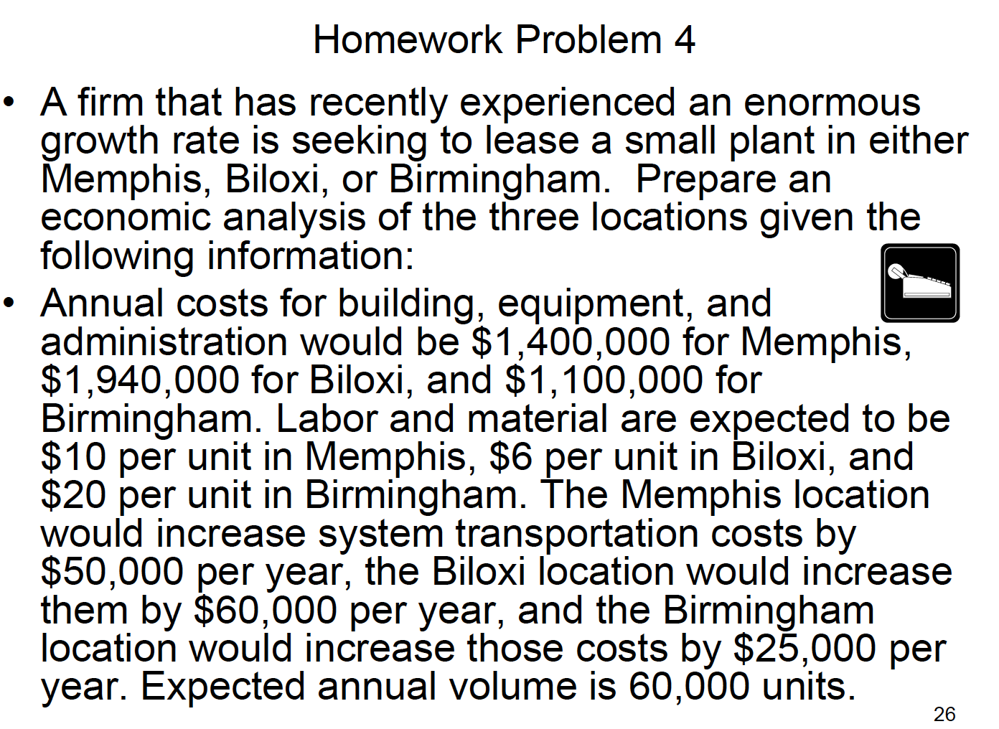
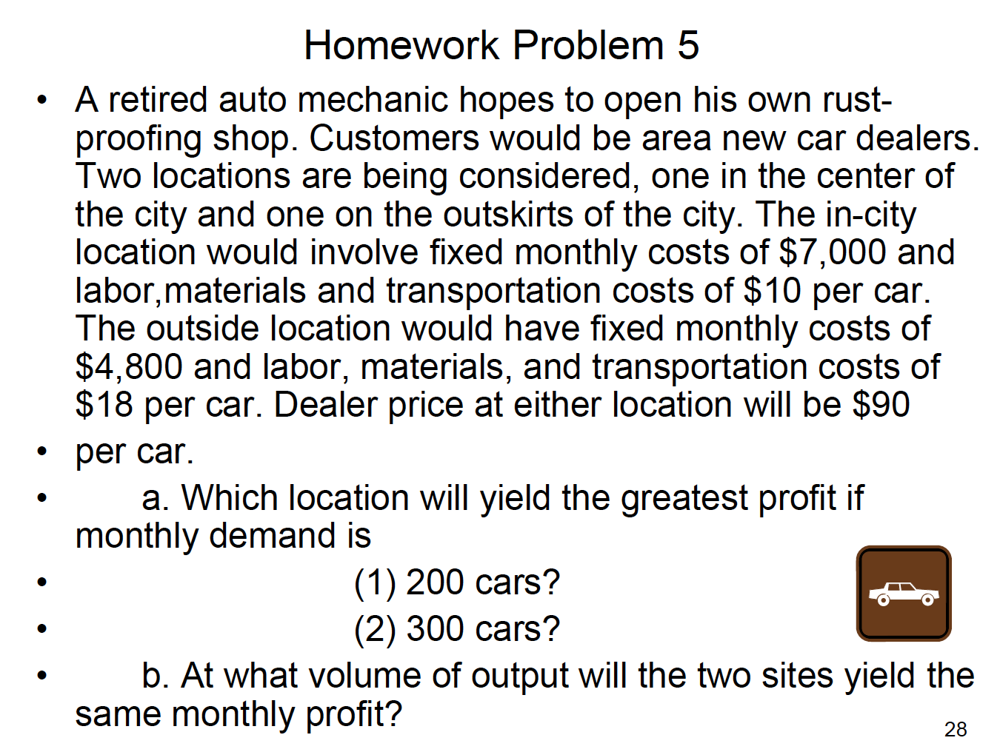
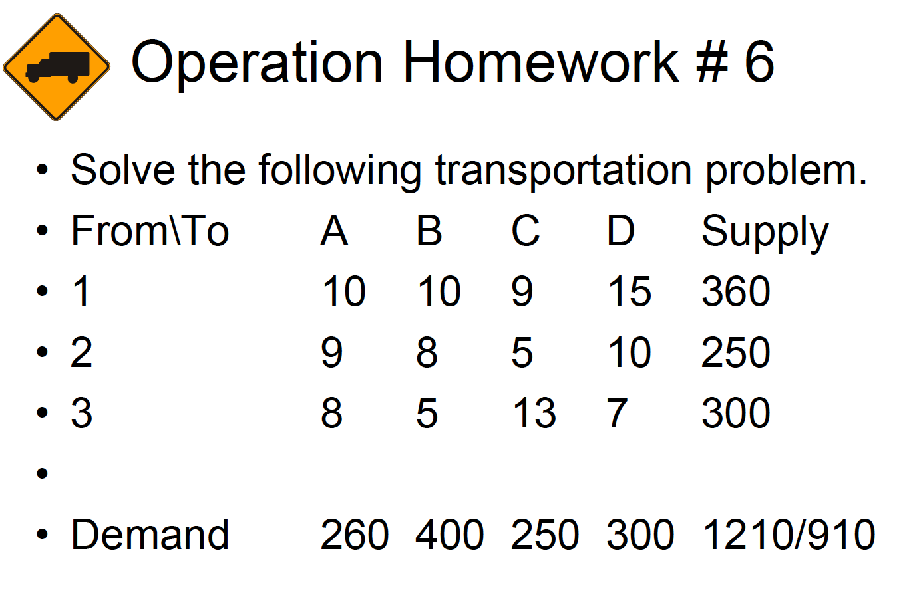
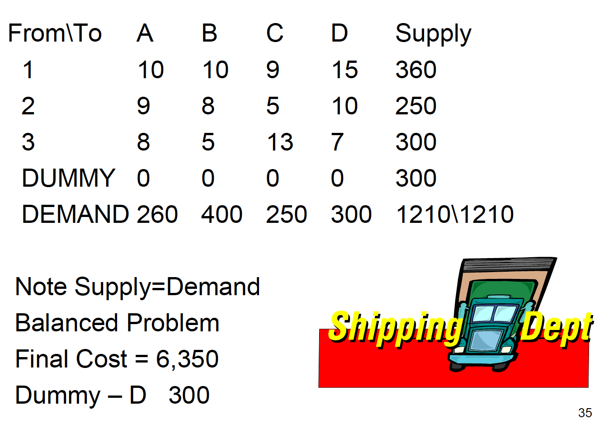
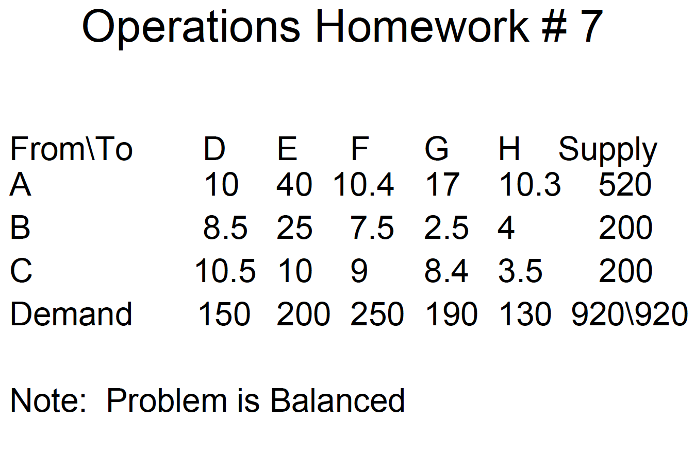

```{r setup, include=FALSE}
knitr::opts_chunk$set(
  echo = TRUE,
  fig.align = 'center'
  )

library(tidyverse)
theme_set(theme_light())
```

```{r packages, eval=FALSE}
library(tidyverse)
```


# Problem 4 

```{r echo=FALSE, out.width = "250px", out.height = "250px"}

```


```{r}
# Memphis - increase system transit cost 50,000
m_fixed_cost = 1400000 + 50000
# $10/ unit 
m_variable_cost = 10

#  Biloxi - increase system transit cost 60,000
bx_fixed_cost = 1940000 + 60000
# $6/unit
bx_variable_cost  = 6

#  Birmingham - increase system transit cost 25,000
b_fixed_cost = 1100000 + 25000
# $20/unit
b_variable_cost = 20

annual_volume = 60000
```

Break-Even Analysis

`TotalCost = FixedCost + (VariableCost * AnnualUsage)`

```{r}
tibble::tibble(
  location = c('Memphis', 'Biloxi', 'Birmingham'), 
  fixed_cost = c(m_fixed_cost, bx_fixed_cost, b_fixed_cost), 
  variable_cost = c(m_variable_cost, bx_variable_cost, b_variable_cost), 
) %>%  
  group_split(location) %>% 
  map_df(~ bind_cols(., tibble(amount = 20000:150000))) %>% 
  mutate(total_cost = fixed_cost + (variable_cost * amount)) %>% 
  ggplot(aes(amount, total_cost, color = location)) + 
  geom_line() + 
  labs(title="Location comparison", x = 'Units', y='Total Cost') + 
  scale_y_continuous(labels = scales::comma_format()) + 
  scale_x_continuous(labels = scales::comma_format()) + 
  theme(legend.position = 'bottom')
```


## Answer: Birmingham V. Mephis 

```{r}
# < Indifference point: 
# Birmingham
# > Indifference point: 
# Memphis
# Indifference point: 
(b_fixed_cost - m_fixed_cost) / (m_variable_cost -  b_variable_cost )
```

## Answer: Memphis V. Biloxi 

```{r}
# < Indifference point: 
# Memphis
# > Indifference point: 
# Biloxi
# Indifference point: 
(bx_fixed_cost - m_fixed_cost) / (m_variable_cost -  bx_variable_cost )
```


# Problem 5

```{r echo=FALSE, out.width = "250px", out.height = "250px"}

```

```{r}
# In City 
city_fixed_cost = 7000
city_variable_cost = 10
# Outside City 
out_fixed_cost = 4800
out_variable_cost = 18

# Dealer Price 
price = 90
demand_1 = 200
demand_2 = 300
```

```{r}
demand = c(demand_1, demand_2)
resp <- tibble(
  location = c('in_city', 'out_city'), 
  fixed_cost = c(city_fixed_cost, out_fixed_cost), 
  variable_cost = c(city_variable_cost, out_variable_cost), 
  price = price
) %>% 
  crossing(demand) %>% 
  mutate(
    total_revenue = price * demand, 
    total_variable_cost = variable_cost * demand, 
    total_cost = total_variable_cost + fixed_cost, 
    net_profit = total_revenue - total_cost
  ) 

resp %>% 
  knitr::kable()

```

```{r}
resp %>% 
  ggplot(aes(demand, net_profit, color = location)) + 
  geom_line() + 
  scale_y_continuous(labels=scales::comma_format()) + 
  labs(title = 'Location comparison', 
       x = 'Demand (cars)', y = 'Net Profit') + 
  theme(legend.position = 'bottom')
```


## Answer: Indefference point

```{r}
# > Indifference point: 
# Out City 
# < Indifference point: 
# In City 
(city_fixed_cost - out_fixed_cost) / (out_variable_cost - city_variable_cost)
```


# Problem 6

```{r echo=FALSE, out.width = "250px", out.height = "250px"}


```

```{r}
library(lpSolve)

# specifying cost matrix 
cost.mat <- matrix(nrow=4,ncol=4)
cost.mat[1,] <- c(10, 10, 9, 15)
cost.mat[2,] <- c(9, 8, 5, 10)
cost.mat[3,] <- c(8, 5, 13, 7)
cost.mat[4,] <- c(0, 0, 0, 0)

# this is a minimization problem
direction = "min"

# capacity may not be exceeded
row.signs <- rep("<=",4)
row.rhs <- c(360, 250, 300, 300)

# demand must be satisfied
col.signs <- rep(">=",4)
col.rhs <- c(260, 400, 250, 300)

solution <- lp.transport(
  cost.mat = cost.mat,
  direction = direction,
  row.signs = row.signs,
  row.rhs = row.rhs,
  col.signs = col.signs,
  col.rhs = col.rhs
  )

cols_ <- c('A', 'B', 'C', 'D')
rows_ <- c('1', '2', '3', '4')

answer <- solution$solution 
rownames(answer) <- rows_
colnames(answer) <- cols_

message('Solution:', solution$objval)
```

```{r echo=FALSE}
answer 
```


# Problem 7

```{r echo=FALSE, out.width = "250px", out.height = "250px"}

```


```{r}
library(lpSolve)

# specifying cost matrix 
cost.mat <- matrix(nrow=3,ncol=5)
cost.mat[1,] <- c(10, 40, 10.4, 17, 10.3)
cost.mat[2,] <- c(8.5, 25, 7.5, 2.5, 4)
cost.mat[3,] <- c(10.5, 10, 9, 8.4, 3.5)
#cost.mat[4,] <- c(0, 0, 0, 0)

# this is a minimization problem
direction = "min"

# capacity may not be exceeded
row.signs <- rep("<=",3)
row.rhs <- c(520, 200, 200)

# demand must be satisfied
col.signs <- rep(">=",5)
col.rhs <- c(150, 200, 250, 190, 130)

solution <- lp.transport(
  cost.mat = cost.mat,
  direction = direction,
  row.signs = row.signs,
  row.rhs = row.rhs,
  col.signs = col.signs,
  col.rhs = col.rhs
  )

cols_ <- c('D', 'E', 'F', 'G', 'H')
rows_ <- c('A', 'B', 'C')

answer <- solution$solution 
rownames(answer) <- rows_
colnames(answer) <- cols_

message('Solution:', solution$objval)
```

```{r echo=FALSE}
answer 
```


