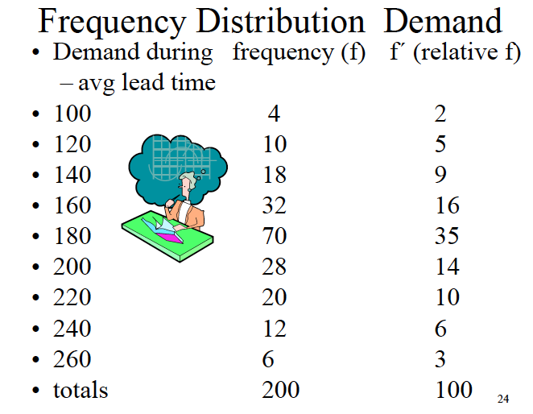

```{r setup, include=FALSE}
knitr::opts_chunk$set(echo = TRUE, fig.align = 'center')
library(tidyverse)
```


## Inventory Problem 

1. Calculating the inventory cost at EOQ 
2. Calculating the point at which we should order inventory Reorder point 

```{r}
# Average inventory cost 
annual_useage = 24000
product_cost = 10 
# Orders per year 
order_annual = 6
# Units per order per year 
units_per_order = annual_useage / order_annual
# Calculate the average amount of inventory on hand to determine 
# the average cost of inventory
max_inventory = 4000
min_inventory = 0 
# Average inventory on hand 
avg_inventory = (max_inventory + min_inventory) / 2

# Average dollar investment for inventory 
avg_inventory * product_cost
```


### Calculating Inventory Cost at EOQ

Economic order quantity is the point that minimizes the carry cost and order cost. 
It is the number (quantity) of products to order. 

- Calculating inventory cost is made of: 
  - EOQ: the optimal quantity to order 
  - Order cost: cost of the order 
  - Carry cost: the carry cost of the inventory

- Variables for calculating EOQ: 
  - OC: Order Cost 
  - AU: Annual Usage 
  - Price
  - Carry Cost (percentage of price)
  - Lead time is not included in EOQ problems.
  
| ` EOQ = sqrt((2 * OC * AU) / (P * CC))`
  
#### Calculate inventory cost 

At EOQ, order cost and carry cost will be equal (rounding might change result). 

```{r}
# Total annual order cost = (AU / EOQ) * OC 
# Quantity 
annual_useage = 15000
EOQ = 600 
# Order cost per unit (given)
order_cost = 15
# Number of orders per year 
annual_useage / EOQ
# Total annual order cost: cost to place all orders for the year 
total_annual_order = (annual_useage / EOQ) * order_cost

# Total annual carry cost = ((EOQ * Price) /2) * Carry Cost 
# Dollars 
price = 5
# Percent 25% 
carry_cost = .25
# Total annual carry cost - divide by 2 to get average dollar investment 
total_annual_order_cost = ((EOQ * price ) / 2) * .25

# Answer 
TotalCost = total_annual_order + total_annual_order_cost
```


What happens when we order some quantity other than EOQ?

- Inventory cost will increase 
- EOQ gives the quantity to order that minimizes total inventory cost. 

### Quantity Discounts Problem 

Should we pass on the discount or take it? Will the discount increase are carry 
costs greater than the amount of the discount?

```{r}
order_cost = 15
carry_cost_pct = .3
annual_useage = 36000

# Price is we order 6,000 or more units (volume discount)
price_disc = 9.8
price = 10 
# Quantity to order 
EOQ = 600 
discount_quantity = 6000

# Product A - No discount - EOQ 
material = annual_useage * price 
order_cost = (annual_useage / EOQ) * 15 
orders_per_year = annual_useage / EOQ 
carry_cost = ((EOQ * price) / 2 ) * carry_cost_pct
total_a = sum(material, order_cost, carry_cost)

# Product B - Discount - Discount Quantity  
material = annual_useage * price_disc 
# Order cost will decrease because of the discount 
order_cost = (annual_useage / discount_quantity) * 15 
orders_per_year = annual_useage / discount_quantity
carry_cost = ((discount_quantity * price_disc) / 2 ) * carry_cost_pct
total_b = sum(material, order_cost, carry_cost)

# We should take the discount - savings of $90.
waldo::compare(total_a, total_b)
```

The average dollar investment for EOQ will be smaller than the average dollar 
investment for bulk purchases (saw tooth graph on top of discount chart with 
much lower inventory turn). 

### Calculating the ROI from taking the disocunt 

`ROI = Savings (from taking discount) / Investment (outlay for product purchase)` 

```{r}
savings = 90 
# Dollars spent to make purchase at discount price 
discount_average_investment = discount_quantity * price_disc / 2
eoq_average_investment = EOQ * price / 2

# Bulk purchasing requires greater up front capital expenditure: calculate ROI 
# on the incremental dollars required to hold the inventory. 
extra_investment_required = discount_average_investment - eoq_average_investment

# ROI is calculated as the savings / the additional capital requirement for 
# making the bulk purchase 
ROI = scales::percent(savings / extra_investment_required, accuracy = .01)
ROI
```

This ROI calculation is the opportunity cost of giving up $26,400 to bulk purchase 
the inventory. 

We can ask the vendor to modify the minimum purchase order for the discount in 
order to reduce the carry cost (greater number of orders in the year) to boost 
the ROI. 


## Re-order point 

The point at which we need to order new product so we don't stock out. 

```{r}
# Total cost of the order - includes shipping, tariffs, etc.
order_cost = 12
# 20%
carry_cost = .2
annual_useage = 3000
price = 4
# Three weeks: Average lead time 
lead_time = 3
# $20  stock out - opportunity cost: when you hit zero and cannot fill an order 
# Do you lose the sale and future business. 
stock_out_cost = 20
weeks_of_operation = 50 
orders_per_year = 10
```


Distribution for product orders: shows the distribution for quantity demanded 
during average lead times.

- Min units sold: 100
- Max units sold: 260 

```{r echo=FALSE, out.width='250px', out.height='250px'}

```


```{r}
# The reorder point will be somewhere greater than zero 
# Step 1: The minimum quantity to keep on hand 
# Average Lead Time Usage = (annual usage / weeks ) * average lead time 
average_lead_time_usage = (annual_useage / weeks_of_operation) * lead_time

# Answer 180 units is the minimum number of units we should keep in stock. 

# Safety Stock: is the difference in current stock and reorder point 
# Stock on hand: 200 
# Reorder point: 180 
# Safety Stock: 20
```


```{r}
data.frame(
  q_demand = seq(100, 260, 20), 
  q_freq = c(4, 10, 18, 32, 70, 28, 20, 12, 6)
) %>% 
  ggplot(aes(q_demand, q_freq)) + 
  geom_col()
```

If we set the reorder point at 260 - the probability of a stock out is zero since 
we have never sold more than 260 units. 

- To calculate the probability of a stock out we calculate the cumulative 
probability of `arrange(desc(order_point)) %>% cumsum(prob_q_demanded)`.
  - By choosing a reorder point with a lower probability of stock out, we 
  reduce the stock out cost incurred. 
  - We need to balance the carry cost, with the cost associated with stock outs. 
  
We have calculated that the reorder point is 180, but has a 33% chance of stock out 
according to historical data. We should set a higher reorder point to reduce 
the chance of stock out. 

**WE minimize the `total cost = stock out cost + carry cost`** 

#### Calculate the Stock Out Cost 

```{r}
# As we raise the reorder point, the stock out cost will be reduced. 
stock_outt <- tibble(
  reorder_point = seq(180, 260, 20), 
  probability_stock_out = c(.33, .19, .09, .03, .0), 
  stockoutcost = (orders_per_year * probability_stock_out) * stock_out_cost
)
stock_outt %>% 
  knitr::kable()
```

#### Calculate the Carry Cost 

```{r}
# As inventory increases, so does the carry cost 
carry_costt <- tibble(
  reorder_point = seq(180, 260, 20), 
  # reorder point - average_lead_time_usage = safety stock level 
  carrycost = ((reorder_point - average_lead_time_usage) * price) * carry_cost
) 
carry_costt %>% 
  knitr::kable()
```

#### Answer 

```{r}
# Choose the lowest total cost that minimizes the carry cost / stock out cost 
stock_outt %>% 
  left_join(carry_costt) %>% 
  mutate(totalcost = stockoutcost + carrycost) %>% 
  knitr::kable()
```
