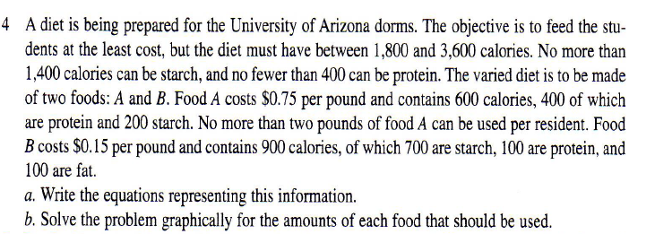
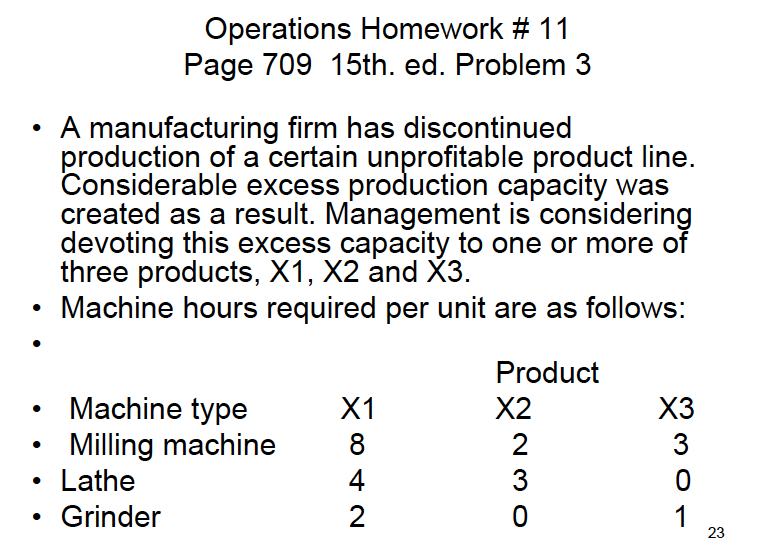
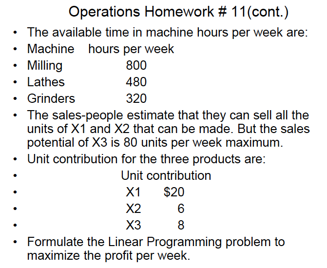
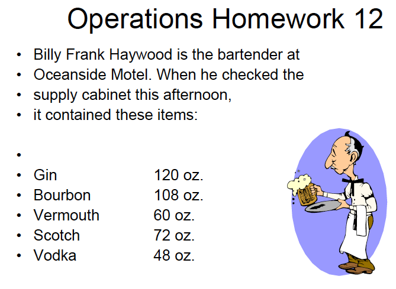
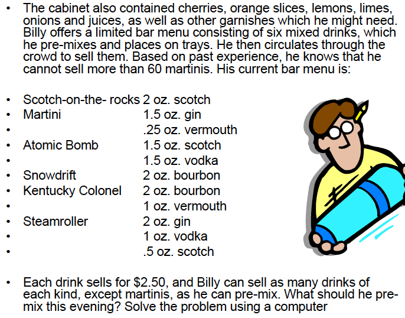

```{r, include = FALSE}
knitr::opts_chunk$set(
  collapse = TRUE,
  comment = "#>", 
  fig.align = 'center'
)
library(operationsMgmt)
library(tidyverse)
theme_set(theme_light())
```


# Work Measurement (video: workmeasurement)

Knowing how long a project or task will take to complete. 

## Measuring Performance New V Old

### Both approaches advocate: 

- Planning & Scheduling: On time delivery is important 
- Budgeting: performance to budget - financial planning 
- You can only budget once you have a plan and a schedule in place
- Performance measurement: 
- Time standards 

### Traditional Approach 

Everything is costed according to a schedule and incentives are used to drive 
efficiency (quotas). 

- Efficiency 
- Cost accounting standards 
- job order & product costing 

### New Philosophies 

Emphasis on quality over quantity. Raw materials are the only true variable 
cost. 

- Performance measurement: Must consider output/ quality of good produced. 
- Efficiency: New philosophy says to not bother looking at the quantity of output. 
Focus on what the schedule calls requires. 
- Cost accounting principles & efficiency do not help make better decisions. 
- Thru-put accounting: the only true variable cost is raw materials 


## Standard Time 

The amount of time it should take a normal qualified worker at a normal place 
to complete a specific task. 

### Time study 

1. *Stop watch studies*: useful for mass production or process shop 
- Observed time: OT = sum(x) / n (simple average)
- Normal time (Performance rate): NT = OT * PR 
- Standard time (Allowance factor): ST = NT * (1+AF)

Purpose of *time study* is to: 

- Eliminate unnecessary work 
- Improve process (Find the bottle neck- look for the weakest point)
- Standardize methods - standardize the procedure and standardize the product. 
Successful product won't change much over time, brands will introduce new 
or derivatives of existing products. 
- Develop the time standards - feeds into master production schedule
- Reduce risk of injury 

```{r}
# Worker is a bit faster than average (Performance Rate)
PR = 1.10 
# Allowance factor 
AF = .15 
ObservedTime = mean(runif(10, 0, 10))

NormalTime = ObservedTime * PR
StandardTime = NormalTime * (1 + AF)
```


2. *Historical times*: project work - building a home; referred to standard 
elemental times  
- How long does it normally take to complete?

3. *Work sampling*: project work - non repetitive office jobs where the work
is unique.
- ratio- delay studies
- analysis of non-repetitive jobs - Ask someone to keep track of what they are 
doing from day to day. 
- Helps to know what a job actually is! 


#### Compensation - related to work sampling - input to compensation

- Time base systems 
- Hourly & salary compensation - time based systems allows to match what the
market. 
- Output based - incentive based or a sales type job

** Emphasizes that quotas and output targets are not good because they do not 
take into consideration quality ** 


# Project Evaluation Review Technique (PERT) Critical Path Method (CPM) (pert)

Project management: tools are very similar to one another - essentialy the
same used to manage Projects.

Project types: 

- Mass production - standardized products 
- Job shops - mix of both 
- Projects - custom projects (houses, bridges, computer network, audit)


## Project management (projects) PERT

- Graphical display PERT diagrams 
- Estimate the time length 
- Identify milestones - important events 
- How long an activity can be delayed without delaying the project 

### Critical path method CPM

Series of events that takes the longest amount of time - will determine how 
long the project will take. 

The task from node 1 to node 3 is the longest task. Both activity from 1 to 2, 
and activity from 1 to 3 occur at the same time. The activity from node 2 to 3
can not begin until the activity from node 1 to 2 is completed. 

```{r}
# Project evaluation review technique
library(visNetwork)
library(tibble)

list(
  nodes = tibble(
    id = 1:3, 
    label = id,
    shape = 'ellipse'
  ), 
  edges = tibble(
    from = c(1,2,1), 
    to = c(2,3,3),
    label = c(8, 3, 14)
  )
) %>% 
  {
    visNetwork(
      nodes = .[[1]], edges =  .[[2]], 
      main = 'PERT')
  } %>% 
  visEdges(
    arrows =list(to = list(enabled = TRUE, scaleFactor = 1)),
    color = list(color = "lightblue", highlight = "red"))

```


Generally minimum time units are hours. 

```{r}
# Calculate TE time estimates for measuring critical paths 

# Most optimistic time 
a=4
# Most pesimistic time 
b = 10
# Best guess 
m = 7 
TimeEstimate = (a + 4*m + b) / 6
```


Critical path is based on the normal distribution.

Central limit theorem - as the sample size increase, the distibution will look 
like the normal distribution. 

Critical path is the longest route to completing the proejct - the activity or 
objective that will require the most attention. 

A - since it is the only beginning event, it must be on the critical path. 
K - since it is the only ending event, it must be on the critical path. 


Nodes 

te time estimate for each point 

EF (TE): Expected completion for that particular point in the project - when will 
I expect to be at various specific points throughout the project. 
- It is calculated by adding the cumulative time of the first node, plus 
the time it takes to get to the next node. 

1 -3-> 2 [[3]]
2 -5-> 4 [[8]]
- Calculated by adding 3 + 5 == 8 (EF value for node 2->5)
- If the ending node has more than one preceding nodes, use the largest value
since the next activity can not begin until all preceding activities are 
finished. 

LF (TL): Latest expected completion time that will not delay the project 
- Start at the bottom and work backwards 
- You project is on schedule as long as you are not taking any more time than 
necessary to complete the critical path. 
- Look at ending nodes and choose the activity with the critical path (activity
that requires the most time). 

SLACK: LF - EF == SLACK  - How much time you have until you delay the entire 
project. 

CP - Is the most important/ significant event on the critical path 
- Near critical path events require just as much attention

### PERT Project evaluation review technique

Multiple beginning and ending events 


```{r}

list(
  nodes = tibble(
    id = letters[1:12], 
    label = id,
    shape = 'ellipse'
  ), 
  edges = dplyr::bind_rows(
    tibble(
      from = c('a', 'b', 'b', 'c', 'f', 'f', 'g', 'g', 'h', 'h', 'j'),
      to = c('b', 'c', 'd', 'e', 'g', 'h', 'i', 'j', 'i', 'j', 'k'),
      label = c(15, 12, 12, 6, 8, 8, 8, 8, 9, 9, 14), 
    ), 
    tibble(
      from = c('d', 'e', 'i', 'k'),
      to = c('k','k','k', 'l'),
      label = c(5, 3, 7, 7), 
    )
  )
) %>% 
  {
    visNetwork(
      nodes = .[[1]], edges =  .[[2]], 
      main = 'PERT')
  } %>% 
  visEdges(
    arrows =list(to = list(enabled = TRUE, scaleFactor = 1)),
    color = list(color = "lightblue", highlight = "red"))
```


Things with more critical paths will be more vulnerable to delaying the project.  

- It is rare that a project will have more than one critical path in reality


# Linear Programming (video: linearprogrammingops)

- Decision Making Under Certainty: value are known and there is no variation 
- Objectives: goals (objective functions- maximization, loss functions) 
- Decision Variables: which products are we going to produce 
- Constraints: Theory of constrains - anything that limits performance (capacity)
- Linear Relationships Between the Variables - keeps us out of calculus 


## Problem Example

Company makes two products: activity based costing.

- Theory of constraints approach: throughput - costing is done only using the 
inputs that can be tied directly to the output ie: raw materials.


We want to maximize contribution - what is the selling price minus the cost to 
make the product. What is the proper mix of products. 

```{r}
# inputs 
setup <- tibble::tibble(
  product = c('car', 'truck'), 
  mold = c(2, 1), 
  paint = c(1, 2), 
  pack = c(1, 1), 
  
) %>% 
  gather('department', 'time', -product) %>% 
  left_join(
    tibble::tibble(
      capacity = c(400, 600, 500), 
      department = c('mold', 'paint', 'pack')
    )) %>% 
  dplyr::mutate(
    output = capacity / time
  ) %>% tibble::rowid_to_column() 

setup
```


Maximize: 2car+2truck
Subject to: 
- 2car+1truck<=400 Mold department 
- 1car+2truck<=600 Paint department 
- 1car+1truck<=500 Pack department 

You can't use more time that you don't have. 


```{r}
setup %>% 
  spread(product, output, fill = 0) %>% 
  ggplot(aes(car, truck), fill = product) + 
  geom_path() + 
  labs(title = 'Everything in the shaded region is workable') + 
  facet_wrap(vars(department))

```


The best possible combinations are the corner points - all of one product or a 
combination of both that achieves the maximum profit (corner point). 

The recommended solution will be the combination that achieves the maximum output. 

SLACK variable - your constraints will always be less than or equal to the maximum
capacity allowed for a specific process or activity. Slack is the residual capacity 
between what is required and the max capacity. Not all activities will have slack. 

- Slack variables will always be constraints <= 
- You cannot have slack if there is a minimum requirement. 

### Maximization Example 3 Products

We want to maximize the contribution given a list of products. Anything problem 
that contains three or more products cannot be graphed so we will solve using an 
equation. 

Contribution for each product: 

```{r}
library(lpSolve)
# Product C provides the highest contribution 
A = 2.4
B = 2.5
C = 3.0
```

Next we set up our constraints - the requirements to produce one unit of a given 
product. 

Subject to: 
Each coefficient is the required units it takes to produce the given product. 

```{r}
# Mill: has a max capacity of 1200 
# 12A + 10B + 8C <= 1200
mill_constraint =  c(12, 10, 8) 
# Inspect
# 5A + 4B + 4C <= 900
inspect_constraint =  c(5, 4, 4)
# Drill
# 10A + 8B + 16C <= 1440
drill_constraint = c(10, 8, 16)
```


```{r}
# Problem setup 
f.type <- 'max'
# contribution of each product 
f.products <- c(A, B, C) 
# Requirements for each department
f.constraints <- matrix(
  c(mill_constraint, inspect_constraint, drill_constraint), nrow = 3, byrow = TRUE
)
# Constraints will always be <= for maximazation 
f.direction <- c('<=', '<=', '<=')
# Capacity per department 
f.capacity <- c(1200, 900, 1440)

resp = lp(f.type, f.products, f.constraints, f.direction, f.capacity)
# Answer 0A + 80B + 50C 
# Payoff: 350 in contribution 
resp$solution
resp$constraints
resp
```

We can calculate there will be *380 slack* in the inspection department: 

```{r}
inspect_req = 50 * 4 + 80 * 4 
# Inspection capacity - solution requirements
SLACK = 900 - inspect_req
SLACK 
```


### Diet problem two different constraints 

Using minimum and maximum constraints. Solving for the number of pounds of 
each product that gives the lowest cost and meets a caloric, starch, and protein
requirements. 

```{r echo=FALSE}

```


Contribution: 
We want to minimize the contribution to our spend.

```{r}
FOOD_A = .75
FOOD_B = .15
```

Subject to (requirements): 
Capacity or requirements for each input starch, protein, calories, pounds product 
a. 

```{r}
# Starch 200A + 700B <= 1400
starch = c(200, 700)
# Protein 400A + 100B >= 400 
protein = c(400, 100)
# Maximum product a in lbs 1A <= 2
lbs_a = c(2, 0)
# Calories 600A + 900B <= 3600
# Calories 600A + 900B >= 1800
upper_calorie = c(600, 900)
lower_calorie = c(600, 900)

# Capacity for each 
capacity_starch = 1400
min_protein = 400 
capacity_a = 2
capacity_calorie = 3600
min_calorie = 1800 
```

Solving the promblem: 

```{r}
library(lpSolve)

# Minimization problem 
direction = "min"
# Contribution for each product towards total spend 
p.contribution = c(FOOD_A, FOOD_B)
# Capacity/ min of each product 
p.products = matrix(
  c(starch, protein, lbs_a, upper_calorie, lower_calorie), nrow = 5, byrow = TRUE
)
# Direction - is it min or max 
p.direction = c('<=', '>=', '<=', '<=', '>=')
# Capacity right hand side 
p.capacity = c(capacity_starch, min_protein, capacity_a, capacity_calorie, min_calorie)

resp_food = lp(
  direction = direction, objective.in = p.contribution, 
  const.mat = p.products, const.dir = p.direction, const.rhs = p.capacity
)
# Answer: 0.5384 pound A, 1.8461 pounds B will give the least expensive required meal. 
# Contribution will be the total cost in this scenario: 0.68076
# We can calculate the slack and surplus for each variable by multiplying the 
# payoff coefficient variable for the answer by the product matrix coefficient, and 
# subtracting from the capacity or limit. 
resp_food$solution
resp_food
```

Surplus variables: 

- If the inequality is greater than or equal to then it is a surplus variable. 


### Example 4 Multi product/ constraint 

Multiple products same as above. 

```{r echo=FALSE}

```

```{r echo=FALSE}

```

The key here is that the maximum number of products that can be sold of product
three by sales is 80. This is a normal constraint just like each other capacity
limit. 

Contribution or payoff for each of the products: Maximization - achieve the best
product mix that will give the highest profit. 

```{r}
# Contribution 
X1 = 20
X2 = 6
X3 = 8
```


Constrains: Subject to (requirements): 
Constraint matrix 

```{r}
# milling 8X1 + 2X2 + 3X3 <= 800
milling = c(8, 2, 3)
# lathe 4X1 + 3X2 + 0X3 <= 480
lathe = c(4, 3, 0)
# grinder 2X1 + 0X2 + 1X3 <= 320
grinder = c(2, 0, 1)
# x3_produxtion 0X1 + 0X2 + 1X3 <= 80
x3_production = c(0, 0, 1)
```

Capacity for each unity, activity, constraint. `But the sales potential for X3
is limited to 80 units per week.` 

- We need to add a capacity that limits the production of X3. 

```{r}
cap_milling = 800
cap_lathe = 480
cap_grinder = 320
cap_x3 = 80
```

Solve the problem

```{r}
library(lpSolve)
# Maximize profit 
z.direction = 'max'
# Contribution of each product 
z.contribution = c(X1, X2, X3)
# Subject to capacity matrix 
z.subject_to = matrix(
  c(milling, lathe, grinder, x3_production), nrow = 4, byrow = TRUE
)
z.directions = c('<=', '<=', '<=', '<=')
z.capacity = c(cap_milling, cap_lathe, cap_grinder, cap_x3)

z.resp = lp(
  direction = z.direction, objective.in = z.contribution, 
  const.mat = z.subject_to, const.dir = z.directions, const.rhs = z.capacity
)
# Answer: Production is 45X1, 100X2, and 80X3 which will produce a payoff of 
# 2,140. 
z.resp$solution
z.resp

```


### Problem 12 

```{r echo=FALSE}

```


```{r echo=FALSE}

```

The problem is asking what is the correct combination of drinks that will produce 
the highest payoff. There is a capacity on one type of drink, Martinis. The 
contribution of all drinks is the same, 2.50. 

```{r}
library(lpSolve)
# Contribution is 2.50 for all drinks
drink.direction = 'max'

# Subject to: capacity for each input 
gin = 120
bourbon = 108
vermouth = 60
scotch = 72
vodka = 48
Martini = 60

# not all drinks require an input - transpose 
# need the ingredients as parts of each output, a drink. 
drink.matrix = matrix(
  c(
    # S,     M,    AB,  SD,  KC,  SR
    c(0,   1.5,  0,   0,   0,   2), # gin
    c(0,   0,    0,   2,   2,   0), # bourbon
    c(0,   .25,  0,   0,   1,   0), # vermouth
    c(2,   0,    1.5, 0,   0,   .5), # scotch
    c(0,   0,    1.5, 0,   0,   1), # vodka
    c(0,   1,    0,   0,   0,   0) # Martini
  ), nrow = 6, byrow = TRUE
)

# Contribution is 2.50 
drink.contribution = rep(2.50, 6)

# Direction - capacity <=
drink.direction_capacity = rep('<=', 6)

# Drink capacity - right hand side 
# [spirits, drinks]
# g, b, v, s, v
drink.capacity = c(gin, bourbon, vermouth, scotch, vodka, Martini)

drink.resp = lp(
  direction = drink.direction, objective.in = drink.contribution, 
  const.mat = drink.matrix, const.dir = drink.direction_capacity, 
  const.rhs = drink.capacity
)
# The payoff is 426.47 - 
drink.resp
drink.resp$solution
```


Should always be able to calculate the slack variable. 

If a constraint is that the solution must equal four ounces, then take the sum 
of all inputs `=` to four. 

|     `A + B + C + D = 4` 


# Product Inventory Control (video: productinventorycontrol)
