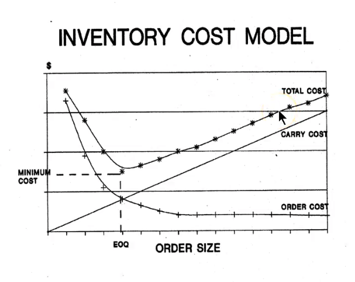
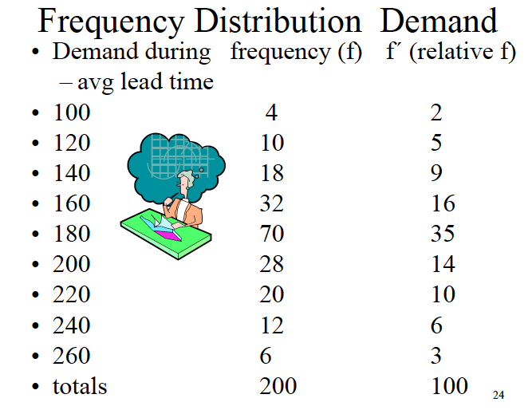

```{r, include = FALSE}
knitr::opts_chunk$set(
  collapse = TRUE,
  comment = "#>", 
  fig.align = 'center'
)
library(operationsMgmt)
library(tidyverse)
theme_set(theme_light())
```


# Master Production Schedule (video:masterproductionsscheduling)

- MPS represents an anticipated build schedule of finished goods (level 0 in the
build of materials (BOM)).
- Finished goods represented by 
  - Forecast: what sales think we will do 
  - Actual orders: actual commitments for product

## MPS Considerations 

- Constraints 
- Environments: mass production, job shop, project 

### Constraints 

Can be less than, greater than, or equal to constraints. 

Anything that limits the ability to produce (time most precious, always a less
than or equal to constraint). 

- Available time (capacity) machine hours
- Inventory: product on hand - can only sell what is available
- Money: capital to produce finished good (raw materials, labor, equipment) 
- Market: could be a less than or greater than constraint - no demand or demand 
out strips the ability to produce. 
- Seasonal demand: matching production with demand (trying to hit a moving 
target). 


### MPS Environments 

Different types of orders. 

- Make to stock (mass production)
- Make to order (project)
- Assemble to order: HP choose your configuration / cars

**Most popular car colors**:  
Black, white, silver, gray, most popular car colors. Red sports car. 


## Master Production Schedule (MPS) Inputs 

- What is the part number: level zero part - Bill of materials will dictate 
how many products we will need for the finished good. 
- How many: Bill of materials (raw materials needed)
- When: when does the finished good need to be delivered by (forward/ reverse 
scheduling). 

### MPS Scheduling in Job Shops 

Questions to ask when building the Master Production Schedule for job shops. 
Can be visualized with a gantt chart. 

- How to distribute the load -- assignment of jobs to work centers 
- Work center: worker and machine
- How to sequence the jobs to the processing
- Order of operations - what is first, second, third. 

Gantt charts can be drawn as a PERT diagram. 

- Resource assignment: planning 

**Un-leveled** (infinite capacity system): means we are building a time budget with
unlimited constraints - will be shown as 104% 

- Level the schedule by pushing different jobs/ activities to where there is 
capacity. 

**Leveled** (finite capacity) schedule: 

- Alternative to a leveled (finite capacity) schedule. 

### Drum-Buffer-Rope

Dr. Goldratt example for managing MPS 

- Drum: the pace of the slowest machine. 
  - Everyone works to the same beat. 
- Buffer: time or inventory. Where WIP goods are stored in-between stages. 
  - building extra time or product for when everything goes wrong 
- Rope: tie the (constraint) back to the first resource. 
  - Wharehouse for the release of material 

Link the rope to the bottle neck (drum) - never want the herby to be idle since
it is the longest running process. 


### Sequencing Rules 

How to order the sequence for building the product to minimize delay. 

- FIFO: First in firs out 
- SPT: Shortest processing time 
- DD: due date 
- S/O: slack per operation

Processing on time delivery: 

- Job: name of the job 
- Process time: time the job will take 
- Due date: date the job will be due 
- Flow time: Job due date - cumulative time to complete previous work
- Days late: Flow time - Due date 

|     `Total Days Late = sum(days_late)`

- Better KPI is the percentage of jobs delivered on time. 

Re-order the jobs using different strategies to improve the days late/ ratio 
of jobs completed on time. 

- Shortest Process Time: 
  - Using SPT we can sort the jobs by the shortest process time
  - This will reduce the total days late
  - Percentage on time is not improved 
  - Lack capacity to complete work 

- DD: Sort by earliest due date/
  - Using DD we sort the jobs by the earliest due date 
  - Slight improvement over SPT 
  - Percentage on time is slightly improved 

- Slack per operation (SPO)
  - Slack = Due Date - Process Time  
  
- Critical Ratio = Slack / Number of open Operations (given number) 
  - Used for ranking 
  - The lowest critical ratio is the order we should order the jobs. 
  

### Johnson method of sequencing 

Algorithm - two steps (with a bottle neck) bottle neck controls the pace. 

1. List jobs and times they will take 
2. Select job with the shortest processing time: 
  - If the job is at the first job center, push the job to the front of the 
  schedule. 
  - If the job is in work center two (two job sequence), push the job to the 
  end of the schedule. 
  - Break ties arbitrarily
  - Repeat step two until all jobs are scheduled. 
  
Sorting algo that orders the jobs by where they are located (work center one 
or work center two). 


Some times jobs will have to wait in buffers if job center two is not ready for 
the part. 

- Consider there might be time to transfer goods between work center one and two.

Three things that can happen with parts moving through a plant: 

1. Parts arrive at second work center just as workers capacity becomes 
available. 
  - Like a relay team (not likely)
2. Parts arrive at second work stations and workers are idle (waiting for 
incoming work). 
3. Parts arrive at second work station and must wait in the buffer until there 
is available capacity. 
  - There is a queue or line of parts that need to be completed before the new 
  part can be processed. 


### Service System Sceheduling 

- Reservation or appointment system
- Variability in both service time and arrival time 
  - Buffer is the waiting room (emergency room) 

### Special projects (CPM)

The tools that we use are PERT and critical path 

## MPS Problem 

- There is an order for 2,000 units with four operations to complete a unit. 
- How many clock hours will it take to process if four hours are allowed 
between operations (buffer)?
- How many parts need to be started in order to complete 2,000 units. 

```{r}

# Time to set up the machine 
# The scrap that results from processing (not all parts pass inspection) 
# Operation time/ unit (how long the process takes)
# Operator lost time due to breaks etc. 
setup <- tibble::tibble(
  service_set_up_time = c(40, 28, 17, 44), # Minutes 
  percent_scrap = c(1, 2.5, 1.5, 3), 
  operation_time_unit = c(2.41, 6.20, .76, 1.37), 
  operator_lost_time = c(.5, .5, .6, .4) # Hours 
)

# Scrap Factor Analysis 

# 2000 is the number of finished goods we want - start in reverse order. 
scrap_4 = 2000 / (1 - .03) 
scrap_3 = scrap_4 / (1 - .015) 
scrap_2 = scrap_3 / (1 - .025) 
scrap_1 = scrap_2 / (1 - .01) 
# We need to start at least 2169 products in order to produce 2,000 finished 
# goods. Don't forget to round up! Would rather have to many than not enough. 


# Operating Time 
# Operation 1: 40 mins + .5 hours 
# This is the time that no work is done: 
operation_1 = (40/60) + .5 # Hours 
operation_2 = (28/60) + .5 # Hours 
operation_3 = (17/60) + .6 # Hours 
operation_4 = (44/60) + .4 # Hours 

# This is the time available after set up time and breaks are subtracted
# Work is done in 8 hour shifts.
op1 = 8 - operation_1
op2 = 8 - operation_2
op3 = 8 - operation_3
op4 = 8 - operation_4
# There is 6.87 hours to complete operation 4 
```

Progblem: Putting it all together.

```{r}
library(magrittr)

answer <- tibble::tibble(
  # Operation 
  operation = c(1, 2, 3, 4), 
  
  # time to complete a unit 
  minutes_per_unit = setup$operation_time_unit, 
  
  # minimum units to start
  quantity_required = c(scrap_1, scrap_2, scrap_3, scrap_4), 
  
  # Total minutes 
  total_minutes_required = minutes_per_unit * quantity_required, 
  
  # Convert to hours
  total_hours_required = total_minutes_required / 60, 
  
  # Amount of time available after breaks and setup time 
  operating_hours_per_day = c(op1, op2, op3, op4),
  
  # Total days to complete 2000 units 
  total_days = total_hours_required / operating_hours_per_day,
  
  # 8 Hours in a working day - Since my final number is recorded in days (total 
  # hours required / operating hours in a day), multiply by the number of working 
  # hours in the day to get the final answer.
  total_hours = total_days * 8
)
answer %>% 
  knitr::kable(digits = 2, format.args = list(big.mark = ','))

```

Add back the amount of time it takes to transfer goods between operations. 

```{r}
# We have four hours between each operation: 3 delays at 4 hours 
# 4 * 3 = 12 
sum(answer$total_hours) + 12 

```


## Master Production Schedule Time Phased Record 

Calculating whats available and what's available to promise. 

- Available = previous available + MPS schedule receipts (if any) minus larger
of forecast vs. orders. 
- Available to Promise = MPS (scheduled receipts) - sum of actual orders up to 
but not include the next MPS. 

**Continue to carry the available into the subsequent weeks.**
```
Available = Initial Value (starting inventory) + MPS scheduled receipts - 
  larger of Forecast or Orders. 

Available = 5 (starting value) + 50 (MPS) - 20 (Forecast)
Available = 35 
```  

Available to promise we only calculate for weeks where we have a MPS scheduled 
receipt (there is a value for MPS). 
  - When there are no orders, all MPS scheduled receipt (the final goods being
  produced/ delivered can be promised). 
```
Available To Promise = MPS - Total Actual Orders up to the next MPS 
Available To Promise = 50 - 12 (orders week 1) - 6 (orders week 2)
Available To Promise = 32
```


# Inventory Control Models (video: eoqreorder)

JIT is the way we run organizations today 

## Classic Inventory Control Models 

- Economic Order Quantity (EOQ):
  - Answers how many we should order at a time 
  - Trade off between constantly re-stocking and maximizing shipping and 
  carry costs

- Reorder point: when do we place an order 
  - Max, min model of how much inventory we should carry at once 

- When considering either strategy for managing inventory we assume: 
  - Demand is known: supermarket - soap, butter 
    - Stock quantity you expect to sell
  - Demand is constant: relatively constant (smooth)
  - Orders are received on time: goods are delivered on time 
  - Orders are received in full: complete orders 
  - Product cost does not vary: recalucalting cost is not a big deal now 
  - No system constraints: there is extra capacity available 
  
If there are items that meet these considerations than Economic order Quantity, 
and Reorder point may be valid methods for managing inventory. 

### Max-Min Model (EOQ/Reorder)

Resembles a saw tooth - meets the assumptions defined above. 

- goods are ordered at time t where the fulfillment period (lead time) is equal
to the number of goods on hand. 
- Demand is constant 
- Reorder point (ROP): when lead time is equal to the remaining products on hand. 
- Orders must come in on time 
- Orders must be complete 
- Stock out: we run out of inventory 

```{r}
library(tidyverse)

tibble::tibble(
  product = rep(seq(20, 0, -1), 3),
  time = seq(as.Date('2020-01-01'), by = 'day', length.out=length(product))
) %>% 
  ggplot(aes(time, product)) + 
  geom_line() + 
  scale_x_date(date_labels = '%b. %d\n%Y') + 
  labs(title = 'Max-Min Model', subtitle = 'EOQ/Reorder')
```


### Inventory cost model 

Order cost and carry cost 

- Carry cost: goal is maximize the benefit of getting the best price while 
managing the costs associated with received larger orders. (balance bluk 
pricing with carry costs). 
  - Small orders: when the order is low, there are fewer costs associated with 
  taking custody of the order. 
    - Large orders require staff, insurance, storage, opportunity cost, etc. 
    
  - Large orders: better unit economics - unit cost is better (cheaper)
  
  - More frequent small orders will incurr more shipping costs
  - Goal is minimize the total `costs = order cost + carry cost`
  
- EOQ: Minimum cost is the intersection of order cost and carry cost 
  - Economic Order Quantity
  - Lead time is not included in EOQ problems. 

```{r echo=FALSE}

```


### Inventory Problem 

```{r}
annual_useage = 24000
product_cost = 10 
# Orders per year 
order_annual = 6
# Units per order per year 
units_per_order = annual_useage / order_annual
# Calculate the average amount of inventory on hand to determine 
# the average cost of inventory
max_inventory = 4000
min_inventory = 0 
avg_inventory = (max_inventory + min_inventory) / 2
# Average dollar investment 
avg_inventory * product_cost
```


### Calculating Inventory Cost at EOQ

Economic order quantity is the point that minimizes the carry cost and order cost. 
It is the number (quantity) of products to order. 

- Calculating inventory cost is made of: 
  - EOQ: the optimal quantity to order 
  - Order cost: cost of the order 
  - Carry cost: the carry cost of the inventory

- Variables for calculating EOQ: 
  - OC: Order Cost 
  - AU: Annual Usage 
  - Price
  - Carry Cost (percentage of price)
  - Lead time is not included in EOQ problems.
  
| ` EOQ = sqrt((2 * OC * AU) / (P * CC))`
  
### Calculate inventory cost 

At EOQ, order cost and carry cost will be equal (rounding might change result). 

```{r}
# Total annual order cost = (AU / EOQ) * OC 
# Quantity 
annual_useage = 15000
EOQ = 600 
# Order cost per unit (given)
order_cost = 15
# Number of orders per year 
annual_useage / EOQ
# Total annual order cost 
total_annual_order = (annual_useage / EOQ) * order_cost

# Total annual carry cost = ((EOQ * Price) /2) * Carry Cost 
# Dollars 
price = 5
# Percent 25% 
carry_cost = .25
# Total annual carry cost - divide by 2 to get average dollar investment 
total_annual_order_cost = ((EOQ * price ) / 2) * .25
TotalCost = total_annual_order + total_annual_order_cost
```


What happens when we order some qunatity other than EOQ?

- Inventory cost will increase 
- EOQ gives the quantity to order that minimzes total inventory cost. 

### Quantity Discounts Problem 

Should we pass on the discount or take it? Will the disocunt increase are carry 
costs greater than the amount of the discount?

```{r}
order_cost = 15
carry_cost_pct = .3
annual_useage = 36000

# Price is we order 6,000 or more units (volume discount)
price_disc = 9.8
price = 10 
# Quantity to order 
EOQ = 600 
discount_quantity = 6000

# Product A - No discount - EOQ 
material = annual_useage * price 
order_cost = (annual_useage / EOQ) * 15 
orders_per_year = annual_useage / EOQ 
carry_cost = ((EOQ * price) / 2 ) * carry_cost_pct
total_a = sum(material, order_cost, carry_cost)

# Product B - Discount - Discount Quantity  
material = annual_useage * price_disc 
# Order cost will decrease because of the discount 
order_cost = (annual_useage / discount_quantity) * 15 
orders_per_year = annual_useage / discount_quantity
carry_cost = ((discount_quantity * price_disc) / 2 ) * carry_cost_pct
total_b = sum(material, order_cost, carry_cost)

# We should take the discount - savings of $90.
waldo::compare(total_a, total_b)
```

The average dollar investment for EOQ will be smaller than the average dollar 
investment for bulk purchases (saw tooth graph on top of discount chart with 
much lower inventory turn). 

### Calculating the ROI from taking the disocunt 

`ROI = Savings (from taking discount) / Investment (outlay for product purchase)` 

```{r}
savings = 90 
# Dollars spent to make purchase at discount price 
discount_average_investment = discount_quantity * price_disc / 2
eoq_average_investment = EOQ * price / 2

# Bulk purchasing requires greater up front capital expenditure 
extra_investment_required = discount_average_investment - eoq_average_investment

# ROI is calculated as the savings / the additional capital requirement for 
# making the bulk purchase 
ROI = scales::percent(savings / extra_investment_required, accuracy = .01)
```

This ROI calculation is the opportunity cost of giving up $26,400 to bulk purchase 
the inventory. 

We can ask the vendor to modify the minimum purchase order for the discount in 
order to reduce the carry cost (greater number of orders in the year) to boost 
the ROI. 


## Re-order point 

The point at which we need to order new product so we don't stock out. 

```{r}
# Total cost of the order - includes shipping, tarriffs, etc.
order_cost = 12
# 20%
carry_cost = .2
annual_useage = 3000
price = 4
# Three weeks: Average lead time 
lead_time = 3
# $20  stock out - opportunity cost: when you hit zero and cannot fill an order 
# Do you lose the sale and future business. 
stock_out_cost = 20
weeks_of_operation = 50 
orders_per_year = 10

# The reorder point will be somewhere greater than zero 
# Step 1: The minimum quantity to keep on hand 
# Average Lead Time Usage = (annual usage / weeks ) * average lead time 
average_lead_time_usage = (annual_useage / weeks_of_operation) * lead_time

# Safety Stock: is the difference in current stock and reorder point 
# Stock on hand: 200 
# Reorder point: 180 
# Safety Stock: 20
```


Distribution for product orders: shows the distrubtion for quantity demanded 
during average lead times.

- Max units sold: 260 
- Min units sold: 100

```{r echo=FALSE}

```

```{r}
library(tidyverse)
data.frame(
  q_demand = seq(100, 260, 20), 
  q_freq = c(4, 10, 18, 32, 70, 28, 20, 12, 6)
) %>% 
  ggplot(aes(q_demand, q_freq)) + 
  geom_col()
```

If we set the reorder point at 260 - the probability of a stock out is zero since 
we have never sold more than 260 units. 

- To calculate the probability of a stock out we calculate the cumulative 
probability of `arrange(desc(order_point)) %>% cumsum(prob_q_demanded)`.
  - By choosing a reorder point with a lower probability of stock out, we 
  reduce the stock out cost incurred. 
  - We need to balance the carry cost, with the cost associated with stock outs. 
  
We have calculated that the reorder point is 180, but has a 33% chance of stock out 
according to historical data. We should set a higher reorder point to reduce 
the chance of stock out. 

**WE minimize the `total cost = stock out cost + carry cost`** 

```{r}
# Calculate the Stock Out Cost 
# As we raise the reorder point, the stock out cost will be reduced. 
stock_outt <- tibble(
  reorder_point = seq(180, 260, 20), 
  probability_stock_out = c(.33, .19, .09, .03, .0), 
  stockoutcost = (orders_per_year * probability_stock_out) * stock_out_cost
)
stock_outt %>% 
  knitr::kable()
```


```{r}
# Calculate the Carry Cost 
# As inventory increases, so does the carry cost 
carry_costt <- tibble(
  reorder_point = seq(180, 260, 20), 
  # reorder point - average_lead_time_usage = safety stock level 
  carrycost = ((reorder_point - average_lead_time_usage) * price) * carry_cost
) 
carry_costt %>% 
  knitr::kable()
```


```{r}
# Choose the lowest total cost that minimizes the carry cost / stock out cost 
stock_outt %>% 
  left_join(carry_costt) %>% 
  mutate(totalcost = stockoutcost + carrycost) %>% 
  knitr::kable()
```


## Simulation (LONG PROBLEM)

Order cost == shipping: the extra cost associated with processing the order. 
- There is no carry cost if there is no inventory 
- If there is 0 units there is no stock out costs 
- If there is 0 units and we sell a unit there IS A stock out cost. 

```{r}
# Simulation problem: start with no open orders

# $1/ Unit / Week on the ending balance 
order_cost = 10 

# $3/ Unit/ Week 
carry_cost = 1

stock_out_cost = 3

# Current stock Units 
balance_on_hand = 12

# Reorder point 
order_point = 7

# EOQ
order_quantity = 8 
```


**Lead time analysis** - *the lead time is not constant*

```{r}
# Simulate the various lead times
lead_times <- tibble(
  lead_time = 1:5, 
  lead_frequency = c(2, 6, 11, 5, 1), 
  # probability the lead time will be 1 week or 5 weeks.
  lead_probability = lead_frequency / sum(lead_frequency), 
  lead_cdf = cumsum(lead_probability)
)

lead_times %>% 
  ggplot(aes(lead_time, lead_cdf)) + 
  geom_line() + 
  scale_y_continuous(labels = scales::percent_format()) + 
  labs(title = '75% of all lead times were three weeks or less')
```


**Demand analysis**: *Demand is not always constant* 

- Have we ever had a situation in which we sold zero units: once 

```{r}
# Historical data 
demand_analysis <- tibble(
  # Units sold in a given week 
  demand_week = 0:6, 
  demand_frequency = c(1, 6, 9, 19, 8, 5, 2), 
  demand_probability = demand_frequency / sum(demand_frequency), 
  demand_cdf = cumsum(demand_probability)
)

demand_analysis %>% 
  ggplot(aes(demand_week, demand_cdf)) + 
  geom_line() + 
  scale_y_continuous(labels = scales::percent_format()) + 
  labs(title = 'Probability three or more units\nsold in a given week is <= 70%', 
  x = 'Quantity demanded / week', y = 'Probability')
```


**Reorder point question**

How many do we have on hand / on order 

- `quantity on hand + quantity on order <= Reorder Point`
  - Yes, place an order 
  - No, don't place an order 


**SIMULATION EXPLANATION** 

```{r}
# Order point is 7: the point at which we need to order new product 
# Starting quantity on hand is 12.
# Week one we do not need to order. 

tibble(
  week = 1:10, 
  # Randomly chosen lead time 1:5 weeks 
  # LeadTimeRandom = hash function for choosing the lead time 
  # Randomly chosen demand 0:6 units / week 
  # DemandNumberRandom = hash function for choosing quantity demanded
  QuantityDemanded = c(1, 3, 2, 4, 2, 1, 3, 3, 0, 4),
  # Starting quantity of 12 - 1 = 11 for week one 
  QuantityOnHand = c(11, 8, 6, 2, 0, -1, 4, 1, 9, 5),
  # Order when TotalQuantity <= 7
  QuantityOrdered = c(0, 0, 0, 8, 0, 0, 8, 0, 0, 0), 
  
  # Lead time probability is used to determine how long the order is in transit
    # Could be a value 1:6. 
          OnOrder = c(0, 0, 0, 0, 8, 8, 0, 8, 0, 0), 
  # Product is received two weeks later 
  QuantityReceived = c(0, 0, 0, 0, 0, 0, 8, 0, 8, 0),
  TotalQuantity = QuantityOnHand + QuantityOrdered + OnOrder,
  OrderCost = ifelse(QuantityOrdered > 0, 10, 0), 
  # Carry cost is $1/ unit on ending balance 
  CarryCost = ifelse(QuantityOnHand > 0, QuantityOnHand * carry_cost, 0), 
  StockOutCost = ifelse(QuantityOnHand < 0, 3, 0),
  TotalCost = OrderCost + StockOutCost + CarryCost, 
  CumulativeCost = cumsum(TotalCost)
) %>% 
  glimpse()
```


- If the Total Quantity is less than or equal to 7, place an order. 
  - The order will have a lead time based on the lead time analysis done
  
Purpose is to balance stock outs, reorder point, and carry costs to reduce 
the cumulative total cost of managing inventory. 

**End simulation**


# Materials Requirement Planning MRP (video: MRP)

- MRP I: Material Requirements Planning 
- MRP II: Manufacturing Resource Planning: 
  - More comprehensive planning solution including labor, products, inputs, etc.

## MRP Assumptions 

- Assumes infinite capacity: meaning that you will figure out a way to correctly 
allocate resources. 
- Fixed lead times: constant lead times
- Parts move in full batches: things will be delivered in full 
  - Remember splitting or back filling a batch with partially completed parts can 
  dramatically reduce lead times 
    - Filling in idle spots 
    
### Bill of materials 

- Independent demand: market demand - our finished good.
- Derived demand: the parts needed based on how many finished goods are sold. 

### Key elements Materials Requirement Planning (MRP) 

We can build to the forecast or to actual order: (right) side is the market

- Primary input to MPS program are orders/ forecast. 
  - Job Shop: build to order 
  - Mass Production: forecast 

- Inventory file (top) is what we have available to complete the orders 
  - What needs to be ordered/ managed - resource planning 
  - Changes are happening all the time to meet demand/ manage costs (carry, 
  order, stock out costs).

- Bill of materials (bottom): what is needed to complete the finished goods 
  - List of requirements 
  - Engineering changes - the improvements made over time (product cycle)
  
- Primary output (Right): tells purchasing what we need to buy to meet the needs 
of the (MPS) Master production schedule 
  - Work orders: what is built internally as part of the BOM 
  - Purchase orders: purchases from outside vendors (raw materials). 
  - MPS changes: feedback loop to meet the needs of the market 


```{r}
nomnoml::nomnoml(
  "# direction: right
[inventory changes] --> [inventory file]
[inventory file] --> [mrp program]

[mps] --> [mrp program]
[bill of material] --> [mrp program]
[engineer changes] --> [bill of material] 
[mrp program] --> [work orders]
[mrp program] --> [mps change]
[mrp program] --> [purchase orders]

[orders] --> [mps]
[forecast] --> [mps]
")

```


## Bills of Materials 

- Single level Bill: Shows each part individually required to build a finished 
good. 
- Indented Bill of Material: More descriptive, shows how all the materials to 
build the finished good
- Summarized Bill of material: summarizes the total number of parts required 
- Where Used Bill of material: shows the heirarchy of where all sub-parts are 
used to make the parent part. 

## MRP Schedule 

Parts and there respective lead times. 

- **Time Phased MRP Record**: 
  - Start with the sub-assemblies, and order parts as needed so they arrive at the
  same time. 
  - As soon as the sub-assembles are built, we can start the finished product. 
  - We can shrink the lead times and total time to completion by building things 
  concurrently **OR** as they are completed. 
  - We can also speed up the process by purchasing goods from outside vendors 
  when possible to free resources internally. 
  
## Just In Time Schedule 

We order goods for when they are needed based on requirement for sub-assemblies 
and the lead time. 


## Example MRP scheduling problem 

```{r}
nomnoml::nomnoml('
# direction:down
[a]
[a] --> [C]
[a] --> [b(2)]
[b(2)] --> [c]
')
```

What is the projected available balance in week number 1?

```{r}
# Batch Size when placing orders 
q = 20
# Lead time 
lead_time = 1
# Safety Stock 
safety_stock = 0
# Starting balance 
starting_balance = 21 

# Work problem 
tibble(
  product = 'parta',
  week = 1:6, 
  # Given part of the problem 
  gross_requirements =        c(5, 15, 18, 8, 12, 22),
  # Starting balance (21) - gross requirements 
  ProjectedAvailableBalance = c(16, 1, 3, 15, 3, 1), 
  # Need to cover the gross requirements for the subsequent week 
  PlannedOrder =              c(0, 20, 20, 0, 20, 0),
  # One week lead time stated in problem 
  ScheduledReceived =         c(0, 0, 20, 20, 0, 20)
) %>% 
  knitr::kable()
```

If we want to reduce the number of stock outs, we can increase the quantity 
ordered. 

We calculate the gross requirements for sub-assembly b by looking at the planned 
orders for product a. 

- Sub-assemblies are derived demand from the finished product. We only need to 
build sub-assemblies when product a is ordered. 
  - Planned order in week 2, 3, and 5 will have gross requirements of: 
  
`b requirements 20 (planned order a) * 2 (each a requires two b sub-assemblies)`

```{r}
# Batch size 40 
q = 40 
# Two week lead timie 
lead_time = 2 

tibble(
  product = 'partb',
  week = 1:6, 
  # Calculated by looking at the Planned order field. 
  gross_requirements =        c(0, 40, 40, 0, 40, 0),
  # Starting balance (20) + scheduled to receive 32 in first week & 0 gross req.
  ProjectedAvailableBalance = c(52, 12, 12, 12, 12, 12), 
  # Need to cover the gross requirements for the subsequent week 
  PlannedOrder =              c(40, 0, 40, 0, 0, 0),
  # Two week lead time stated in problem 
  ScheduledReceived =         c(32, 0, 40, 0, 40, 0)
) %>% 
  knitr::kable()
```


Part c: to get the gross requirements - multiply the planned order releases for 
part a and c by 1.. 


```{r}
# Lot for lot: order what is required 
q = 'LotForLot'
# One week lead time 
lead_time = 1
# Maintain safety stock of 10: Add 10 to gross_requirements 
a = c(0, 20, 20, 0, 20, 0)
b = c(40, 0, 40, 0, 0, 0)
c_gross_requirements  = a + b

tibble(
  product = 'partc',
  week = 1:6, 
  # Calculated by looking at the Planned order field. 
  gross_requirements =  c_gross_requirements, # 40, 20, 60, 0, 20, 0
  # Starting balance (50) + scheduled to receive 32 in first week & 0 gross req.
  ProjectedAvailableBalance = c(10, 10, 10, 10, 10, 10), 
  # Need to cover the gross requirements for the subsequent week 
  PlannedOrder =              c(20, 60, 0, 20, 0, 0),
  # Two week lead time stated in problem 
  ScheduledReceived =         c(0, 20, 60, 0, 20, 0)
) %>% 
  knitr::kable()
```

The gross requirements are given for product zero. 
